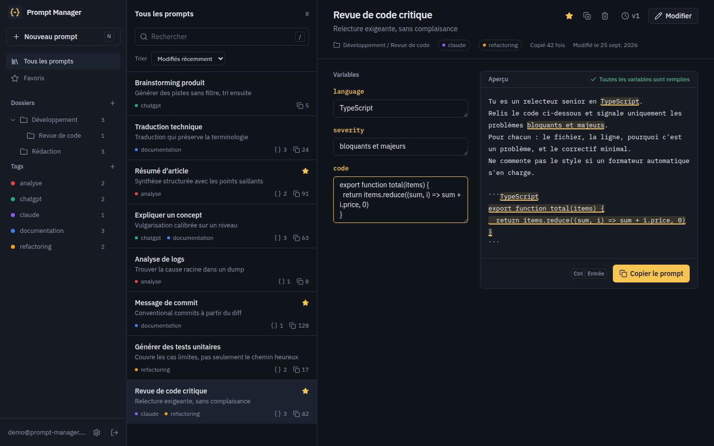
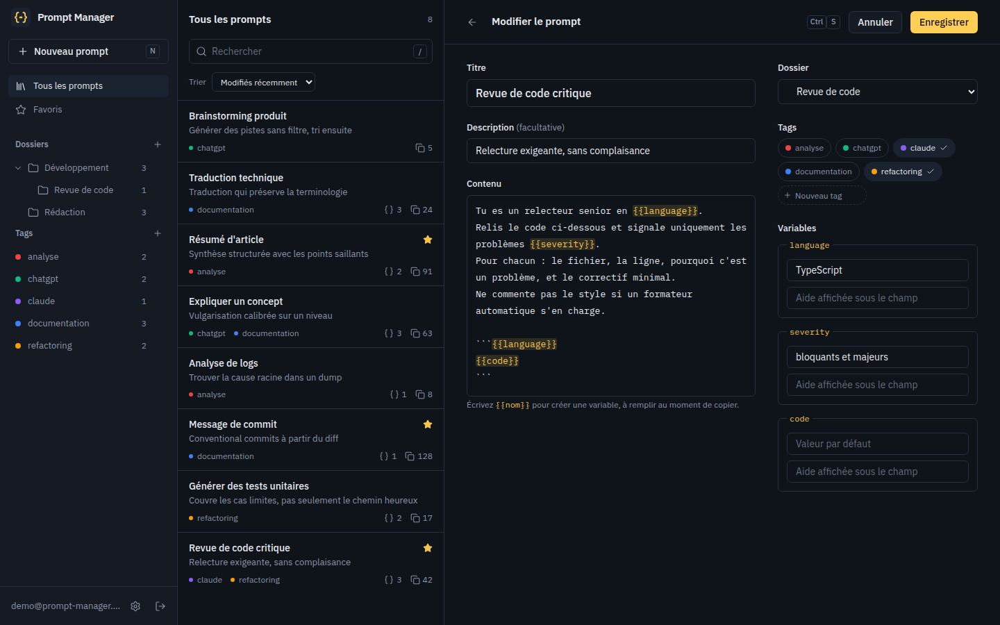
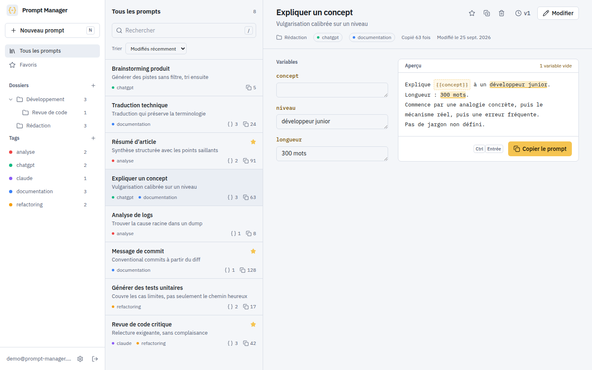
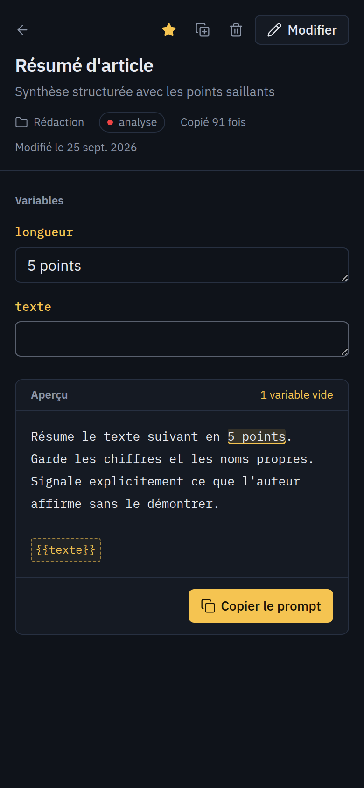

# Prompt Manager

Rangez, retrouvez et réutilisez vos prompts IA. Écrivez un prompt une fois avec des
`{{variables}}`, remplissez-les au moment de l’utiliser, copiez, collez dans votre modèle.

Open source (MIT) et auto-hébergeable : une base PostgreSQL, un Redis, deux conteneurs.



## Fonctionnalités

- **Variables** : `{{langage}}`, `{{ton}}`… détectées à la frappe, avec valeur par défaut et aide.
  Aperçu en direct, variables vides repérables d’un coup d’œil, copie en `Ctrl`/`⌘` + `Entrée`.
- **Organisation** : dossiers imbriqués, tags colorés, favoris, recherche plein texte (titre,
  description, contenu, tags), tri par date, usage ou titre. Les filtres vivent dans l’URL.
- **Historique** : chaque modification du titre ou du contenu crée une version ; une ancienne
  version se restaure sans rien écraser.
- **Import / export** : JSON portable (dossiers par chemin, tags par nom) pour passer d’une
  instance à l’autre, Markdown lisible pour archiver.
- **Multi-utilisateurs** : chaque compte ne voit que ses données. Access token en mémoire,
  refresh token `httpOnly` à rotation, rejeu détecté et session révoquée.
- **Interface** : thème sombre par défaut (clair disponible), dense, pilotable au clavier
  (`N` nouveau prompt, `/` rechercher, `Ctrl`/`⌘` + `S` enregistrer), utilisable sur mobile.

| Éditeur                                                           | Thème clair                                | Mobile                                                   |
| ----------------------------------------------------------------- | ------------------------------------------ | -------------------------------------------------------- |
|  |  |  |

## Auto-hébergement (Docker)

```bash
git clone https://github.com/KD63799/AIPM.git prompt-manager && cd prompt-manager
cp .env.example .env    # renseignez POSTGRES_PASSWORD et JWT_SECRET (openssl rand -base64 48)
docker compose up -d --build
```

L’application répond sur http://localhost:8080 (variable `PORT`). Le backend applique les
migrations à chaque démarrage. Derrière un reverse proxy TLS, transmettez `X-Forwarded-Proto` :
le cookie de session passe alors en `Secure`.

Pour Kubernetes (K3s + Traefik), voir [`k8s/`](k8s) et [`deploy.sh`](deploy.sh).

## Développement

Prérequis :

- Node.js 24 LTS (ou 22.22.3+, exigé par Angular CLI 22) : `nvm use` lit `.nvmrc`
- Docker, pour PostgreSQL et Redis
- [Task](https://taskfile.dev) (`brew install go-task`)

```bash
task install                          # dépendances racine, backend, frontend + hooks git
cp backend/.env.example backend/.env
task dev                              # Postgres + Redis, puis API et frontend
task seed                             # compte de démo : demo@prompt-manager.local / demo1234
```

- Frontend : http://localhost:4200 (le serveur de dev relaie `/api` vers le backend)
- API : http://localhost:3000/api, santé sur http://localhost:3000/health

```bash
task --list      # toutes les tâches
task lint        # ESLint backend + frontend
task test        # tests unitaires
task test:e2e    # tests e2e de l’API, sur une base <nom>_test créée automatiquement
task ci          # lint, unitaires et e2e, comme la CI
```

## Architecture

```
frontend/  Angular 22 : composants standalone, signals, httpResource, Tailwind CSS 4
backend/   NestJS 11 : un module par domaine (auth, users, folders, tags, prompts, export)
           Prisma 7 + PostgreSQL 16, Redis 7 pour les sessions
k8s/       manifestes K3s, namespace prompt-manager
```

Le frontend appelle l’API sur la même origine (`/api`) : proxy Angular en dev, nginx en
production. Pas de CORS, cookie de session limité à `/api/auth`.

| Méthode | Route                                              | Rôle                                                 |
| ------- | -------------------------------------------------- | ---------------------------------------------------- |
| POST    | `/api/auth/register`, `/login`                     | ouvre une session                                    |
| POST    | `/api/auth/refresh`, `/logout`                     | renouvelle (rotation) ou ferme la session            |
| PATCH   | `/api/auth/password`                               | change le mot de passe, déconnecte les autres        |
| GET     | `/api/users/me`                                    | compte courant (`DELETE` pour le supprimer)          |
| CRUD    | `/api/folders`, `/api/tags`, `/api/prompts`        | ressources de l’utilisateur courant                  |
| GET     | `/api/prompts?q=&folderId=&tagId=&favorite=&sort=` | recherche et filtres                                 |
| POST    | `/api/prompts/:id/use`, `/duplicate`               | compte une utilisation, duplique                     |
| GET     | `/api/prompts/:id/versions`                        | historique ; `POST …/versions/:n/restore` restaure   |
| GET     | `/api/export`, `/api/export/markdown`              | export JSON ou Markdown ; `POST /api/import` importe |

## Contribuer

Les contributions sont bienvenues : lisez [CONTRIBUTING.md](CONTRIBUTING.md). Les règles de
code du projet sont dans [CLAUDE.md](CLAUDE.md). Pour une faille de sécurité, suivez
[SECURITY.md](SECURITY.md) plutôt que d’ouvrir une issue publique.

## Licence

[MIT](LICENSE)
